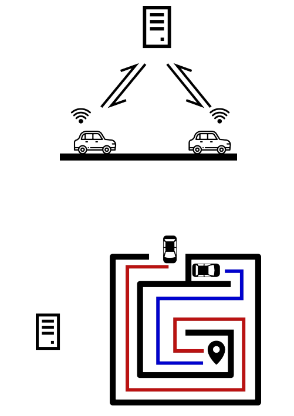
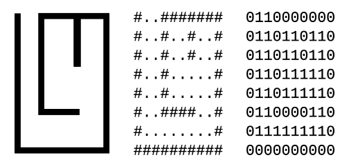
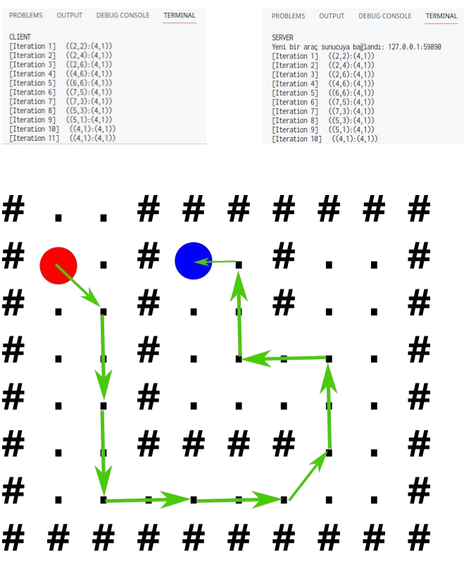

# Car Client
Simple car route calculation with client-server architecture and using `basic_pathfinding` library.

Project Diagram:

Map is encoded as simple string. Walls are represented as '#', walkable ways are represented as '.' character.

After server started up, output of client is:

This is client code for route calculating example. Server is on this repo https://github.com/codesole/rust-networking